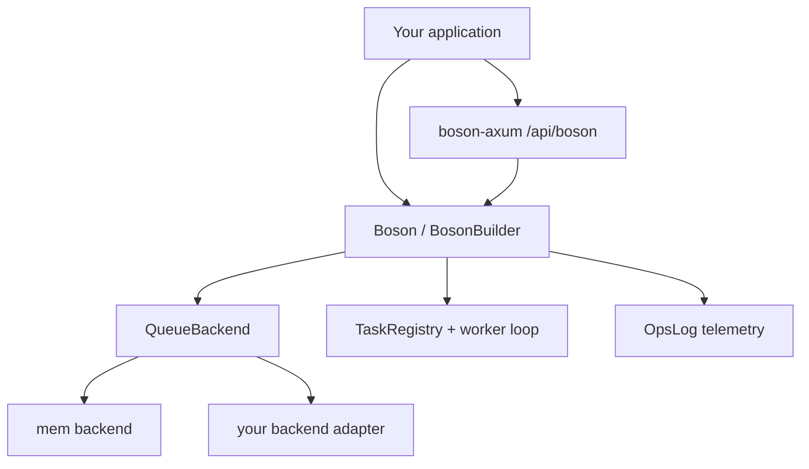

[](https://github.com/unified-field-dev/boson/actions/workflows/boson-matrix.yml)
[](LICENSE-MIT)

[GitHub](https://github.com/unified-field-dev/boson) · `cargo doc -p uf-boson --features mem,axum --open` · [Benchmarks](boson-bench/README.md)

# Boson

Boson is a Rust job-work runtime for services that need durable background tasks, retries,
rate limits, and pluggable persistence.

Start with one decision:

| Goal | Backend feature |
|------|-----------------|
| Local proof-of-concept | `mem` |
| Single-node durability | `sqlite` |
| Shared durable state | `postgres` |
| Broker-backed fleet | `redis` or `nats` (read those crate docs first) |

## Minimal boot

```rust,no_run
use std::sync::Arc;

use boson::{configure, Boson, JsonExecutionContextFactory, MemQueueBackend};

#[tokio::main]
async fn main() -> anyhow::Result<()> {
    let boson = Boson::builder()
        .queue_backend(Arc::new(MemQueueBackend::new()))
        .execution_context_factory(JsonExecutionContextFactory)
        .auto_registry()
        .build()?;

    configure(boson);
    Ok(())
}
```

Add tasks with `#[task]` and enqueue via `send_with`. See the hero example below and
`cargo doc -p uf-boson --features mem,axum --open` for the guided get-started (embedded vs
remote worker topology).

## What Boson owns

Boson owns enqueue orchestration, worker dispatch, leases, retries, and task configuration.

Your application owns business logic, identity mapping, and backend choice.

## Task + enqueue example

```rust,ignore
use std::sync::Arc;

use boson::{
    configure, task, Boson, ExecutionContext, JsonExecutionContextFactory,
    MemQueueBackend,
};

#[task(name = "process_order")]
async fn process_order(
    ctx: Box<dyn ExecutionContext>,
    order_id: String,
    amount_cents: u64,
) -> boson_core::Result<()> {
    tracing::info!(actor = ctx.label(), %order_id, amount_cents);
    Ok(())
}

#[tokio::main]
async fn main() -> anyhow::Result<()> {
    let boson = Boson::builder()
        .queue_backend(Arc::new(MemQueueBackend::new()))
        .execution_context_factory(JsonExecutionContextFactory)
        .auto_registry()
        .build()?;
    configure(boson);

    ProcessOrder::send_with(
        serde_json::json!({"System": {"operation": "checkout"}}),
        ProcessOrderParams {
            order_id: "ord-42".into(),
            amount_cents: 9900,
        },
    )
    .await?;
    Ok(())
}
```

**Status:** v0.1.0 · MIT · [GitHub](https://github.com/unified-field-dev/boson)

## Architecture



## Quick start

Add the facade crate with the in-memory backend for local evaluation. The crates.io
package is **`uf-boson`** (the name `boson` is taken); imports stay `use boson::…`:

```toml
[dependencies]
boson = { package = "uf-boson", version = "0.1.0", features = ["mem"] }
tokio = { version = "1", features = ["rt-multi-thread", "macros"] }
anyhow = "1"
```

Enable features explicitly — `uf-boson` ships with **no default features** (`default = []`). See [Cargo features](#cargo-features) below.

API details: [`boson/README.md`](boson/README.md) and `cargo doc -p uf-boson --features mem --open`.

## Cargo features

| Feature | Enables | Notes |
|---------|---------|-------|
| `mem` | In-memory `QueueBackend` | Tests and local dev |
| `sqlite` | Embedded SQLite `QueueBackend` | Single-node persistence |
| `postgres` | PostgreSQL `QueueBackend` | Shared persistence |
| `telemetry-console` | Console `OpsLog` | Optional stderr instrumentation |
| `axum` | HTTP admin API | Routes under `/api/boson` |
| *(none)* | Port + runtime only | `default-features = false` |

## When to use it

**Good fit**

- Background jobs with retries, rate limits, and lease-based workers
- Systems that need a `QueueBackend` implementation, not a full workflow engine
- Admin HTTP for enqueue, job inspection, and task config

**Not a fit**

- Cron scheduling or delayed-job DSLs (wrap Boson in your scheduler)
- Cross-service pub/sub or event streaming (use a transport log + fanout layer)
- Full message broker semantics (Boson is job-oriented, not topic-oriented)

## Workspace

| Crate | Role |
|-------|------|
| [`boson`](boson/README.md) | Main crate (re-exports, feature flags) |
| [`boson-macros`](boson-macros/README.md) | `#[boson::task]` proc macro + Quark inventory registration |
| [`boson-core`](boson-core/README.md) | `QueueBackend` trait, DTOs, router, identity hooks |
| [`boson-runtime`](boson-runtime/README.md) | `Boson` / `BosonBuilder`, worker loop, task registry |
| [`boson-telemetry`](boson-telemetry/README.md) | `OpsLog` trait and console/no-op adapters |
| [`boson-backend-mem`](boson-backend-mem/README.md) | In-memory `QueueBackend` for tests and CI |
| [`boson-backend-sqlite`](boson-backend-sqlite/README.md) | SQLite `QueueBackend` |
| [`boson-backend-postgres`](boson-backend-postgres/README.md) | PostgreSQL `QueueBackend` |
| [`boson-backend-redis`](boson-backend-redis/README.md) | Redis fleet `QueueBackend` |
| [`boson-backend-nats`](boson-backend-nats/README.md) | NATS JetStream fleet `QueueBackend` |
| [`boson-axum`](boson-axum/README.md) | HTTP admin API under `/api/boson` |
| [`boson-testkit`](boson-testkit/README.md) | Shared scenarios, matrix, and bootstrap fixtures |
| [`boson-e2e`](boson-e2e/README.md) | Matrix correctness integration tests |
| [`boson-bench`](boson-bench/README.md) | Synthetic benchmark CLI |

## Third-party adapters

1. Implement [`QueueBackend`](boson-core/src/backend/queue_backend.rs) using portable DTOs from `boson-core`.
2. Publish as `yourorg-boson-backend-{substrate}`.
3. Optional: bootstrap helper that registers on [`QueueRouter`](boson-core/src/router/queue_router.rs).
4. Document required worker mode and lease TTL expectations.

See [`boson-core/README.md`](boson-core/README.md) for trait details.

## Verify

Full baseline: [`docs/VERIFICATION.md`](docs/VERIFICATION.md). Contribute checklist: [`CONTRIBUTING.md`](CONTRIBUTING.md).

**Remote CI (optional):** mirror the PR subset on a provisioned native-aws bench host:

```bash
~/aws/boson/run-remote-ci.sh
```

**Merge gate:** [`.github/workflows/boson-matrix.yml`](.github/workflows/boson-matrix.yml) runs check, `cargo-deny`, clippy, crate tests, full broker e2e (postgres/redis/nats), axum, examples, docs, coverage, and bench smoke on every push/PR to `main`.

## Documentation

| Doc | Covers |
|-----|----------|
| `cargo doc -p uf-boson --features mem,axum --open` | Architecture and API reference |
| [`docs/supply-chain.md`](docs/supply-chain.md) | `cargo-deny` and Git dependency policy |
| [`SECURITY.md`](SECURITY.md) | Vulnerability reporting |
| [`boson-macros/README.md`](boson-macros/README.md) | `#[task]` macro, policies, inventory |
| [`boson/examples/task_macro.rs`](boson/examples/task_macro.rs) | End-to-end macro + worker drain example |
| [`boson-core/README.md`](boson-core/README.md) | `QueueBackend` trait and DTOs |
| [`boson-runtime/README.md`](boson-runtime/README.md) | Builder, worker loop, task registry |
| [`boson-bench/README.md`](boson-bench/README.md) | Benchmark CLI |
| [`boson-bench/EXPERIMENTS.md`](boson-bench/EXPERIMENTS.md) | Experiment registry and campaigns |
| [`boson-bench/PERFORMANCE_STUDY.md`](boson-bench/PERFORMANCE_STUDY.md) | Performance study and scale analysis |
| [`boson-backend-redis/README.md`](boson-backend-redis/README.md) | Redis fleet backend |
| [`boson-backend-nats/README.md`](boson-backend-nats/README.md) | NATS JetStream fleet backend |

## Glossary

| Term | Meaning |
|------|---------|
| **Quark / inventory** | Link-time task discovery — handlers annotated with `#[task]` register via [Quark](https://github.com/unified-field-dev/quark) when their crate is linked into the worker binary |
| **LWT (lease-backed idempotency)** | Default idempotency mode — concurrent enqueues with the same key reuse one non-terminal job |
| **Pool** | Named worker partition — jobs in pool `A` are claimed only by workers polling pool `A` |
| **Lease** | Time-bound worker lock on a job — required when multiple workers share one backend |
| **send_with** | Typed enqueue method generated by `#[task]` for each handler |
